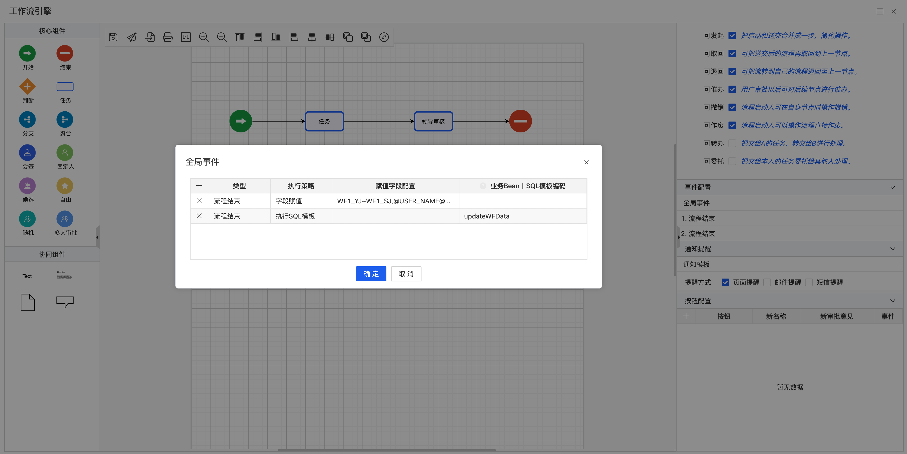
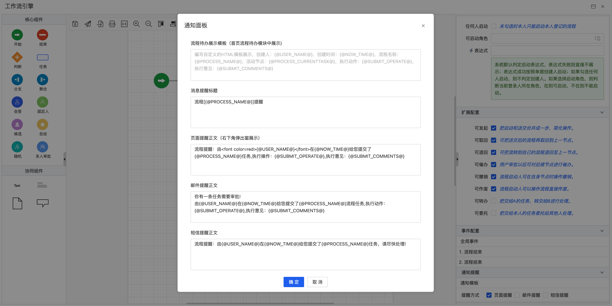

# 更新日志

## v2.0.9 (2023-09-22)
### Features
- 【基础平台】：展示字段支持微应用嵌入
- 【基础平台】：新增renderVNode函数，支持动态渲染组件到指定dom
- 【基础平台】：扩展面板支持微应用嵌入

### Bug Fixes
- 【主项目】：优化微应用加载机制
- 【基础平台】：优化组件加载资源逻辑
- 【基础平台】：修复下拉框值不转为label显示
- 【基础平台】：多附件图片宽高样式处理
- 【基础平台】：修复子功能集合批量添加失败
- 【基础平台】：扩展面板微应用加载完后进行布局刷新操作
- 【基础平台】：表单字段帮助提示样式修复
- 【基础平台】：列表及其表单帮助提示样式修改
- 【基础平台】：表单保存后，刷新activeBean信息
- 【子系统引擎】：表达式设计器回显逻辑修改
- 【子系统引擎】：子功能添加微应用项
- 【子系统引擎】：表达式设计器初始化数据的时候没有小红点
- 【子系统引擎】：解决高级后缀js模版点进去是空的问题
- 【子系统引擎】：解决pc端列表配置默认值不回显问题

### 数据升级包
- [升级包](./upgrade/2/0/JECloud2.0.9升级包.zip)
- [升级文档](./upgrade/README.md)
- 各子项目代码请分别下载

## v2.0.8 (2023-09-17)
### Features
- 【基础平台】：功能列表删除数据时刷新列表数据
- 【基础平台】：树形功能更多按钮如果配置了权限依赖按钮需要按照对应的按钮权限进行过滤
- 【基础平台】：子功能集合根据配置改变高度
- 【基础平台】：showFuncConfig支持$func参数为功能编码字符串
- 【基础平台】：功能表单组件支持内容颜色配置
- 【子系统引擎】： app列表配置代码优化

### Bug Fixes
- 【基础平台】：列表拖拽时兼容自定义属性
- 【基础平台】：优化redis连接池配置，修复590问题

### 数据升级包
- 此版本无数据升级包，仅升级各子项目代码即可

## v2.0.7 (2023-09-09)
### Features
- 【基础平台】：优化功能配置菜单代码
- 【基础平台】：增加扩展面板支持
- 【基础平台】：功能表单工作流按钮前面的竖线优化
- 【基础平台】：关联查询的列不随功能列配置隐藏
- 【基础平台】：树形选择回显值滚动到选中第一个节点的位置
- 【基础平台】：单选复选框添加前后缀插槽
- 【基础平台】：新增二维码工具函数
- 【基础平台】：切换部门信息显示添加公司信息
- 【基础平台】：当人登录人切换部门时，如果身处两个不同的公司，在部门后面添加公司名称
- 【资源表】：优化应用表速度

### Bug Fixes
- 【基础平台】：修复子功能事件失效问题
- 【基础平台】：列表删除后需刷新列表tbar状态
- 【基础平台】：树形操作接口没有返回bean信息修复
- 【基础平台】：表单字段默认值，获取当前用户得所处公司信息为null问题修复

### 数据升级包
- [升级包](./upgrade/2/0/JECloud2.0.7升级包.zip)
- [升级文档](./upgrade/README.md)
- 各子项目代码请分别下载
## v2.0.6 (2023-09-01)
### Features
- 【基础平台】：列头的渲染函数代码优化
- 【基础平台】：表单保存级联保存子功能
- 【基础平台】：表单没有保存按钮后，不执行只读表达式
- 【基础平台】：表单页面刷新功能时重新加载功能权限
- 【基础平台】：关联查询进入的功能始终显示关键字查询
- 【基础平台】：树形选择支持刷新按钮显隐
- 【基础平台】：子功能集合如果没有配置功能就通过必填校验
- 【基础平台】：高级查询添加启用导出按钮配置
- 【基础平台】：meta项目修改redisConfig配置，添加redis线程池参数
- 【工作流引擎】：添加预警实现，支持提醒和自定义方法，[使用说明](https://doc.jepaas.com/docs/je-doc-jecloud-help/je-doc-jecloud-help-1f0553g2bjtce)

### Bug Fixes
- 【基础平台】：解决子功能列表重复刷新问题
- 【基础平台】：列表添加后默认激活第一行
- 【基础平台】：修复子功能集合保存带值错误问题
- 【基础平台】：修复子功能集合主子带值配置
- 【基础平台】：树形功能左侧菜单编辑修复

### 数据升级包
- [升级包](./upgrade/2/0/JECloud2.0.6升级包.zip)
- [升级文档](./upgrade/README.md)
- 各子项目代码请分别下载

## v2.0.5 (2023-08-25)
### Features
- 【基础平台】：角色授权放开开发者机构
- 【基础平台】： 表单功能刷新重写加载表单数据
- 【基础平台】： 处理点击首行录入的列表数据进表单,因为该种数据的主键id是uuid生成的,掉接口查回来是空值,需要给默认值
- 【基础平台】： 功能列表编辑进入表单的方式根据配置
- 【基础平台】： 列表统计调用接口读取功能配置的action路径
- 【基础平台】： 新增showFuncForm4Promise，支持读取表单宽高配置
- 【基础平台】： 表单item组件支持tooltip模式下的错误提示改变展示位置
- 【基础平台】： 支持弹出时表单宽高
- 【菜单引擎】： 菜单添加数据弹窗加loading效果
- 【子系统引擎】： 子系统表单字段是字段类型的选择字典时自动生成configinfo
- 【平台设置引擎】： 平台设置回显值加判空

### Bug Fixes
- 【基础平台】： 表单保存，等待子功能集合保存后执行其他事件
- 【基础平台】： 功能审核报错修复
- 【基础平台】： 修复弹出表单宽高失效问题
- 【基础平台】： 弹窗组件按钮loading修复
- 【资源表引擎】： 表辅助表名相同后缀字段错乱修复
- 【工作流引擎】：流程筛选人员时，加载sql权限缓存问题修复

### 数据升级包
- [升级包](./upgrade/2/0/JECloud2.0.5升级包.zip)
- [升级文档](./upgrade/README.md)
- 各子项目代码请分别下载

## v2.0.4 (2023-08-18)
### Features
- 【基础平台】：人员选择器，人员回显查询接口修改传参，优化代码逻辑
- 【基础平台】：多表头支持修改文字颜色
- 【基础平台】：高级查询支持列表导出
- 【基础平台】：功能列表多表头颜色处理
- 【基础平台】：功能列表展示复选框优化
- 【基础平台】：人员选中器回显人员优化
- 【基础平台】：下拉框组件加loading效果
- 【工作流引擎】：工作流审批界面切换节点人员选中回显优化
- 【工作流引擎】：流程执行sql模板添加日志
- 【工作流引擎】：首页展板内容添加功能名称字段

### Bug Fixes
- 【基础平台】：修复顶部菜单设置人员权限无效
- 【基础平台】：关联选择查询初始值需要带上查询条件
- 【基础平台】：子功能集合事件传参model修复
- 【基础平台】：修复获取树形节点路径问题
- 【资源表引擎】：表辅助表名相同后缀字段错乱修复

### 数据升级包
- [升级包](./upgrade/2/0/JECloud2.0.4升级包.zip)
- [升级文档](./upgrade/README.md)
- 各子项目代码请分别下载

## v2.0.3 (2023-08-11)
### Features
- 【工作流引擎】：优化处理待办逻辑，将修改数据改成一次性处理
- 【工作流引擎】：催办消息添加到首页展板里面，点击消息可以弹出表单内容
- 【基础平台】：增加parseDDCustomVariables解析字典动态参数函数
- 【基础平台】：异步树初始化节点查询条件使用缓存条件
- 【基础平台】：功能列表导出支持平台默认和模板导出
- 【基础平台】：抽离日期组件的公共函数，适配datetime类型
- 【基础平台】：新创建的功能，导出按钮默认不受控

### Bug Fixes
- 【工作流引擎】：退回之后不再显示催办按钮和转办按钮
- 【工作流引擎】：跳跃审批意见修改意见
- 【工作流引擎】：预警配置修改
- 【基础平台】：列表保存数据处理null
- 【基础平台】：修复异步树形检索报错问题
- 【基础平台】：附件删除时级联删除业务数据优化
- 【基础平台】：修改树形列表查询指定节点信息返回值，如果没有value传参，直接返回空

### 数据升级包
- 此版本无数据升级包，仅升级各子项目代码即可

## v2.0.2 (2023-08-04)
### Features
- 【工作流引擎】：邮件正文提醒默认值修改
- 【工作流引擎】：工作流事件配置优化
- 【工作流引擎】：退回、驳回、取回没有context信息
- 【工作流引擎】：修复流程发起后如果是结束节点会报异常信息
- 【工作流引擎】：表单属性，解析字段readOnly字段做适配兼容
- 【工作流引擎】：将流程自动跳跃的意见改成统一的
- 【首页展板】：通知面板点击消息弹出功能表单
- 【基础平台】：表单功能刷新时同步刷新列表
- 【基础平台】：添加url路由策略，get和post请求支持url添加pd参数路由，post请求支持添加formData参数pd路由
- 【基础平台】：子功能集合添加数据，如果前端传参存在treeOrderIndex，后端使用前端传递的参数，不自动生成了
- 【基础平台】：添加清理redis缓存异步接口
- 【基础平台】：首页展板消息支持表单弹出
- 【基础平台】：新建功能，列表编辑按钮默认使用范围ALL
- 【基础平台】：清理权限添加异步clear接口

### Bug Fixes
- 【工作流引擎】：工作流筛选条件显隐修复
- 【工作流引擎】：工作流权限执行前先执行重置表单
- 【工作流引擎】：工作流流转同步刷新列表加判空
- 【工作流引擎】：启动表达式修复
- 【首页展板】：流程和通知面板的数值联动变化
- 【基础平台】：树形选择智能剔除修复
- 【基础平台】：修复产品创建开发者角色时，没有找到子功能造成的空指针异常
- 【基础平台】：子功能集合添加数据，找不到外键问题修复
- 【基础平台】：热修复SQL模板未增加默认来源描述的问题

### 数据升级包
- [升级包](./upgrade/2/0/JECloud2.0.2升级包.zip)
- [升级文档](./upgrade/README.md)
- 各子项目代码请分别下载

## v2.0.1 (2023-07-30)
### Features
- 【工作流引擎】：工作流可处理人配置加拖拽排序
- 【工作流引擎】：工作流去掉画布的双击事件
- 【工作流引擎】：工作流全局事件添加面板修改
- 【工作流引擎】：工作流事件弹窗组件增加列表拖拽排序
- 【工作流引擎】：工作流事件添加默认值
- 【工作流引擎】：工作流添加传阅配置
- 【工作流引擎】：工作流添加可催办配置
- 【工作流引擎】：工作流引擎列表下拉框弹出位置修改
- 【工作流引擎】：节点事件弹窗列表列头修改
- 【工作流引擎】：可处理人添加sql定义类型
- 【工作流引擎】：配置项增加问号说明
- 【工作流引擎】：添加预警延期配置
- 【工作流引擎】：预警配置重构

### Bug Fixes
- 【工作流引擎】：修复全局事件，审批意见无法带入。
- 【工作流引擎】：修复全局事件，赋值构造器显示字段的中文名称。
- 【工作流引擎】：修复全局事件，执行SQL模板失效问题。
- 【工作流引擎】：修复短信提醒方式失效。
- 【工作流引擎】：修复邮件通知格式，调整模板数据。
- 【工作流引擎】：修复预警配置出现null值。
- 【工作流引擎】：修复列表排序方式，调整为按照时间倒序。
  
  

### 数据升级包
- [升级包](./upgrade/2/0/JECloud2.0.1升级包.zip)
- [升级文档](./upgrade/README.md)
- 各子项目代码请分别下载
