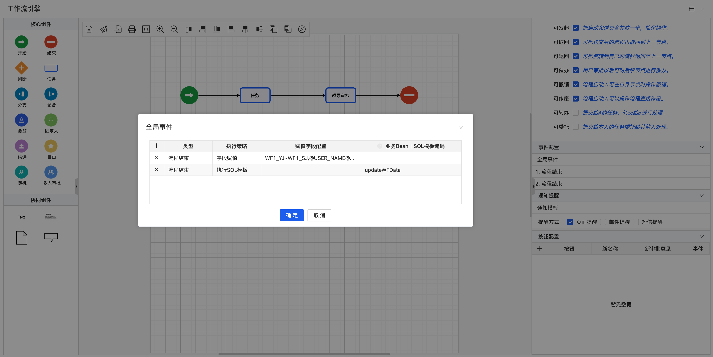
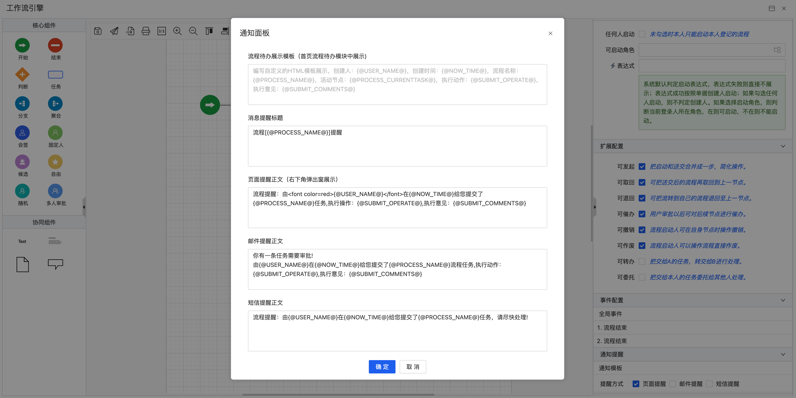

# 更新日志
## v2.0.1 (2023-07-30)
### 升级包
- [升级文档](./upgrade/2.0.1/README.md)
- [升级包](./upgrade/2.0.1/JECloud2.0.1升级包.zip)
### Features
- 【工作流引擎】：工作流可处理人配置加拖拽排序
- 【工作流引擎】：工作流去掉画布的双击事件
- 【工作流引擎】：工作流全局事件添加面板修改
- 【工作流引擎】：工作流事件弹窗组件增加列表拖拽排序
- 【工作流引擎】：工作流事件添加默认值
- 【工作流引擎】：工作流添加传阅配置
- 【工作流引擎】：工作流添加可催办配置
- 【工作流引擎】：工作流引擎列表下拉框弹出位置修改
- 【工作流引擎】：节点事件弹窗列表列头修改
- 【工作流引擎】：可处理人添加sql定义类型
- 【工作流引擎】：配置项增加问号说明
- 【工作流引擎】：添加预警延期配置
- 【工作流引擎】：预警配置重构

### Bug Fixes
- 【工作流引擎】：修复全局事件，审批意见无法带入。
- 【工作流引擎】：修复全局事件，赋值构造器显示字段的中文名称。
- 【工作流引擎】：修复全局事件，执行SQL模板失效问题。
- 【工作流引擎】：修复短信提醒方式失效。
- 【工作流引擎】：修复邮件通知格式，调整模板数据。
- 【工作流引擎】：修复预警配置出现null值。
- 【工作流引擎】：修复列表排序方式，调整为按照时间倒序。
  
  