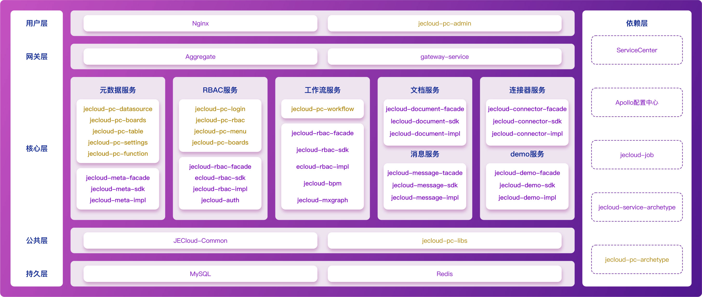

<a href="https://jecloud.net" target="_blank">官方网站</a> &nbsp;  &nbsp;  &nbsp;
<a href="https://doc.jepaas.com/docs/je-doc-jecloud-help/je-doc-jecloud-help-1e2ka6h6mrfhi" target="_blank"  >帮助文档</a>&nbsp;  &nbsp;  &nbsp;
 <a href="https://space.bilibili.com/519497352/channel/series" target="_blank"  >视频教程</a>&nbsp;  &nbsp;  &nbsp;
<a href="./CHANGELOG.md" target="_blank"  >更新日志</a>&nbsp;  &nbsp;  &nbsp;

# 一、项目简介

JECloud平台后端采用微服务架构，前端采用微应用架构，可做到不同服务使用不同数据库独立运行。全平台采用基于模型驱动的设计模式，并在前后端留有大量的代码植入入口，方便开发者对平台进行改造扩充。JECloud适合软件开发公司、企业信息中心、个人开发者使用，适用于开发ERP、OA、CRM、EAM、WMS、MES、PM等企业级信息化系统，是企业数字化转型的必备工具。

# 二、系统演示
- [演示系统（每日12点、24点系统自动恢复默认数据库状态）](http://example.jecloud.net)
- 用 户 名：admin
- 密    码：123456

# 三、项目部署
1、安装版（仅支持Linux）
- [安装包下载](https://jecloud.net/experience)
- [安装手册下载](https://doc.jepaas.com/docs/je-doc-jecloud-help/je-doc-jecloud-help-1eidf5a6pbrrk)

2、Docker-Compose版（支持Linux、Windows）
- [安装包下载](https://jecloud.net/experience)
- [安装手册下载](https://doc.jepaas.com/docs/je-doc-jecloud-help/je-doc-jecloud-help-1eie6mb20uqei)

> **项目部署如需协助请加微信：18610941078（请注明“JECloud安装协助”字样）**
# 四、License文件替换
JECloud License 文件存放目录说明如下（[公用jecloud.license下载](./resource/jecloud.license)）:

1、安装版（仅支持Linux） 
- linux 存放目录：`/root/license/`

2、Docker-Compose版（支持Linux、Windows）
- 安装包目录：`jecloud-docker-compose-v2.0.x/license/`

3、源码版
- linux 存放目录：`/root/license/`
- windows 存放目录：当前用户的家目录下新建license文件夹，放入license文件，[参考windows家目录](https://blog.51cto.com/aiyc/5457000 "参考windows家目录")

# 五、源码下载

<table width=100% align=center>
<tr>
  <td colSpan='2'> 
    
  </td>
</tr>
<tr>
  <td colSpan='2'> 
    <b>前端项目</b>
  </td>
</tr>
<tr>
  <td> 
    <ul>
      <li><a href="https://gitee.com/ketr/jecloud-pc-admin.git" target="_blank">主项目（jecloud-pc-admin）</a></li>
      <li><a href="https://gitee.com/ketr/jecloud-pc-archetype.git" target="_blank">骨架项目（jecloud-pc-archetype）</a></li>
      <li><a href="https://gitee.com/ketr/jecloud-pc-libs.git" target="_blank">基础库项目（jecloud-pc-libs）</a></li>
      <li><a href="https://gitee.com/ketr/jecloud-pc-table.git" target="_blank">资源表项目（jecloud-pc-table）</a></li>
      <li><a href="https://gitee.com/ketr/jecloud-pc-function.git" target="_blank">应用中心项目（jecloud-pc-function）</a></li>
      <li><a href="https://gitee.com/ketr/jecloud-pc-workflow.git" target="_blank">工作流项目（jecloud-pc-workflow）</a></li>
    </ul>
  </td>
  <td> 
    <ul>
      <li><a href="https://gitee.com/ketr/jecloud-pc-rbac.git" target="_blank">RBAC项目（jecloud-pc-rbac）</a></li>
      <li><a href="https://gitee.com/ketr/jecloud-pc-menu.git" target="_blank">菜单项目（jecloud-pc-menu）</a></li>
      <li><a href="https://gitee.com/ketr/jecloud-pc-datasource.git" target="_blank">数据源项目（jecloud-pc-datasource）</a></li>
      <li><a href="https://gitee.com/ketr/jecloud-pc-settings.git" target="_blank">系统设置项目（jecloud-pc-settings）</a></li>
      <li><a href="https://gitee.com/ketr/jecloud-pc-login.git" target="_blank">登录项目（jecloud-pc-login）</a></li>
      <li><a href="https://gitee.com/ketr/jecloud-pc-boards.git" target="_blank">展板项目（jecloud-pc-boards）</a></li>
    </ul>
  </td>
</tr>
<tr>
  <td colSpan='2'> 
    <b>后端项目</b>
  </td>
</tr>
<tr>
  <td> 
    <ul>
      <li><a href="https://gitee.com/ketr/jecloud-common.git" target="_blank">基础项目（jecloud-common）</a></li>
      <li><a href="https://gitee.com/ketr/jecloud-gateway.git" target="_blank">动态网关项目（jecloud-gateway）</a></li>
      <li><a href="https://gitee.com/ketr/jecloud-meta.git" target="_blank">元数据项目（jecloud-meta）</a></li>
      <li><a href="https://gitee.com/ketr/jecloud-rbac.git" target="_blank">RBAC项目（jecloud-rbac）</a></li>
      <li><a href="https://gitee.com/ketr/jecloud-workflow.git" target="_blank">工作流项目（jecloud-workflow）</a></li>
    </ul>
  </td>
  <td> 
    <ul>
      <li><a href="https://gitee.com/ketr/jecloud-document.git" target="_blank">文档项目（jecloud-document）</a></li>
      <li><a href="https://gitee.com/ketr/jecloud-message.git" target="_blank">消息项目（jecloud-message）</a></li>
      <li><a href="https://gitee.com/ketr/jecloud-connector.git" target="_blank">连接器项目（jecloud-connector）</a></li>
      <li><a href="https://gitee.com/ketr/jecloud-demo.git" target="_blank">案例项目（jecloud-demo）</a></li>
      <li><a href="https://gitee.com/ketr/jecloud-service-archetype.git" target="_blank">骨架项目（jecloud-service-archetype）</a></li>
    </ul>
  </td>
</tr>
<tr>
  <td colSpan='2'> 
    <b>中间件项目</b>
  </td>
</tr>
<tr>
  <td> 
    <ul>
      <li><a href="https://gitee.com/ketr/jecloud-auth.git" target="_blank">认证中间件（jecloud-auth）</a></li>
      <li><a href="https://gitee.com/ketr/jecloud-bpm.git" target="_blank">工作流中间件（jecloud-bpm）</a></li>
    </ul>
  </td>
  <td> 
    <ul>
      <li><a href="https://gitee.com/ketr/je-ibatis.git" target="_blank">JEIbatis（je-ibatis）</a></li>
      <li><a href="https://gitee.com/ketr/jecloud-mxgraph.git" target="_blank">mxgraph封装（jecloud-mxgraph）</a></li>
    </ul>
  </td>
</tr>
</table>

# 六、技术选型

<table width=100% align=center>
<tr><td colspan=4></td></tr>
<tr><td width=30% ><b>开发语言</b></td><td  width=70% colspan=3>Java，JavaScript</td></tr>
<tr><td><b>技术架构</b></td><td colspan=3>后端项目采用微服务架构，前端项目采用微前端架构</td></tr>
<tr><td><b>数 据 库</b></td><td colspan=3>开源版仅支持MySQL</td></tr>
<tr><td width=50% colspan=2  align=center ><b>后端项目</b></td><td  width=50% colspan=2 align=center ><b>前端项目</b></td></tr>
<tr><td colspan=2>注册中心: ServiceCenter</td><td colspan=2>核心框架: Vue3</td></tr>
<tr><td colspan=2>微服务框架: ServiceComb</td><td colspan=2> 路由框架: VueRouter4</td></tr>
<tr><td colspan=2>调用链追踪: SkyWalking </td><td colspan=2>状态管理框架: Pinia2 </td></tr>
<tr><td colspan=2>日志收集: SkyWalking</td><td colspan=2>国际化框架: Vuei18n 9 </td></tr>
<tr><td colspan=2>应用负载: OpenResty </td><td colspan=2>CSS 预处理框架: Less3 </td></tr>
<tr><td colspan=2>动态网关: Service Edge </td><td colspan=2>微应用框架: Micro-App </td></tr>
<tr><td colspan=2>缓存服务: Redis</td><td colspan=2>UI框架: AntDesign Vue3 </td></tr>
<tr><td colspan=2>统一配置中心: Apollo</td><td colspan=2>构建工具: Webpack 4Gulp4 </td></tr>
<tr><td colspan=2>调度框架: XXLJob </td><td colspan=2>Npm 包管理: Lerna4,Yalc </td></tr>
<tr><td colspan=2>消息队列: RocketMQ</td><td colspan=2>表格组件: VxeTable </td></tr>
<tr><td colspan=2>监控系统: Promethus</td><td colspan=2> 代码编辑器: MonacoEditor</td></tr>
<tr><td colspan=2>应用框架: SpringBoot2</td><td colspan=2>画图工具: MxGraph </td></tr>
<tr><td colspan=2>视图框架: SpringMVC </td><td colspan=2>富文本编辑器: Tinymce </td></tr>
<tr><td colspan=2>工作流: Activiti 7、JECIoudBPM</td><td colspan=2>Http 请求类库: Axios </td></tr>
<tr><td colspan=2>ORM: MyBatis、JEDB</td><td colspan=2>拖拽类库: Sortablejs </td></tr>
<tr><td colspan=2>认证框架: Sa-Token,JECloud-Auth </td><td colspan=2>日期类库: Dayjs </td></tr>
<tr><td colspan=2>项目构建工具: Maven </td><td colspan=2>工具类库: Lodash </td></tr>
</table>

# 七、开源协议
- [MIT](./LICENSE)
- [平台证书补充协议](./SUPPLEMENTAL_LICENSE.md)

# 八、用户点赞

# 九、联系我们

# 十、项目截图
1、微服务架构图

2、 平台功能架构图

3、资源表引擎

4、列表规划器

5、标准功能列表

6、列锁定+复杂表头列表

7、表单规划器

8、标准表单

9、主从表单

10、工作流规划器

